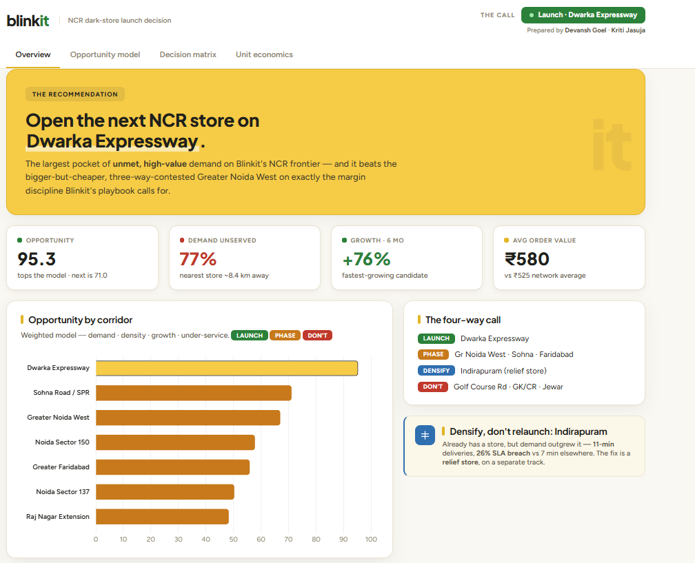

# Blinkit NCR — Dark-Store Launch Decision

A product-management portfolio project: a go-to-market decision, backed by SQL.

🔗 **Live dashboard:** https://blinkit-ncr-gtm.vercel.app  ·  📊 [Decision deck (PPTX)](Blinkit_NCR_GTM_deck.pptx)



> **The question:** Blinkit already leads Delhi NCR. So on the growth frontier, **which corridor earns the next dark store** — the most incremental, profitable demand we're losing — and where would we only cannibalise ourselves?
>
> **The call:** **Launch on Dwarka Expressway / New Gurugram** (opportunity score **95.3 / 100**) — the biggest pocket of unmet, high-value demand on the frontier. Phase Greater Noida West (bigger, but a thin basket and three rivals); densify Indirapuram; decline already-saturated and sub-scale zones.

---

## What's inside

| File | What it is |
|------|------------|
| `index.html` | **Interactive dashboard** — live opportunity model (drag the weights), decision matrix, and break-even calculator. This is what Vercel serves. |
| `Blinkit_NCR_GTM_deck.pptx` | The decision deck (6 dense slides: gap → model → pick → rollout → economics → decision). |
| `analysis.sql` | The full SQL analysis — 6 queries (city trend, area scorecard, growth, opportunity model, decision, densification). |
| `case_study.md` | The written case study and methodology. |
| `generate_data.py` | Seeded generator for the synthetic demand dataset. |
| `run_analysis.py` | Loads the CSVs into SQLite and runs each query in `analysis.sql`. |
| `blinkit_areas.csv`, `blinkit_dark_stores.csv`, `blinkit_orders.csv` | The dataset. |

## Run the analysis locally

```bash
python generate_data.py    # (re)creates the three CSVs
python run_analysis.py      # runs the 6 SQL queries and prints results
```
Requires Python 3 with `pandas` and `numpy`. `blinkit_orders.csv` is large and fully reproducible — you can delete it and regenerate it any time with `generate_data.py`.

## The model (in one line)

`opportunity = 100 × (0.30·demand + 0.20·density + 0.25·growth + 0.25·under-service)`, each driver min-max-normalised across candidate corridors, with two hard guards: ≥90% already served → *don't* (cannibalisation); catchment < 40k households → *don't* (sub-scale).

## Data & sources note

Company facts and **all economics are real** (Eternal / Blinkit FY26 reporting — ~2,243 dark stores, NCR as the largest market, AOV ~₹525, ~₹30/order blended contribution, first adjusted-EBITDA-profitable quarter in Q3 FY26, 5–6%-of-NOV mature-market target). The **pincode-level demand data is illustrative** — modelled on Blinkit's public NCR footprint, because order-level logs are proprietary. This is an independent case study, not affiliated with Blinkit.
